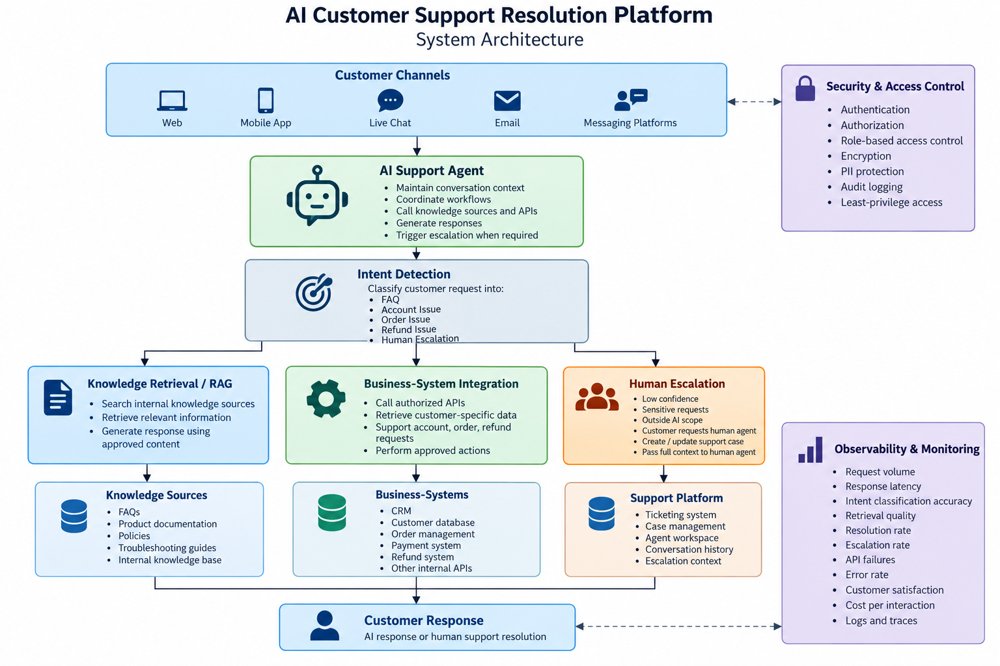

# AI Customer Support Resolution Platform
## System Architecture

## 1. Architecture Overview

The AI Customer Support Resolution Platform is designed to automate
repetitive customer-support interactions while maintaining controlled
access to internal knowledge, business systems, and human support.

The architecture consists of the following major components:

1. Customer Interface
2. AI Support Agent
3. Intent Detection
4. Knowledge Retrieval / RAG
5. Business-System Integration
6. Human Escalation
7. Observability and Monitoring
8. Security and Access Control

---

## 2. High-Level Architecture



```
Customer
   |
   v
Web / Mobile / Chat
   |
   v
AI Support Agent
   |
   v
Intent Detection
   |
   +-------------------+
   |                   |
   v                   v
Knowledge / RAG     Business APIs
   |                   |
   v                   v
Knowledge Base       CRM / Orders /
                     Payments / Refunds
   |                   |
   +---------+---------+
             |
             v
       Response / Action
             |
             v
          Customer

Complex / Sensitive / Low-Confidence
             |
             v
      Human Escalation
             |
             v
        Human Agent
```

---

## 3. Component Architecture

### 3.1 Customer Interface

The customer interacts with the support solution through an existing or
future customer-support channel.

Possible channels include:

- Web
- Mobile application
- Live chat
- Email
- Messaging platforms

The interface sends the customer's request to the AI support platform.

---

### 3.2 AI Support Agent

The AI Support Agent is responsible for coordinating the handling of the
customer request.

Responsibilities include:

- Receiving the customer request.
- Maintaining conversation context.
- Sending the request to intent detection.
- Selecting the appropriate processing path.
- Calling approved knowledge or business tools.
- Generating the final response.
- Triggering human escalation when required.

The agent should operate within defined permissions and business rules.

---

### 3.3 Intent Detection

The Intent Detection component determines what the customer is trying to
achieve.

For the MVP, the supported intents are:

1. FAQ
2. Account Issue
3. Order Issue
4. Refund Issue
5. Human Escalation

Example:

Customer:

> "What is your return policy?"

Intent:

> FAQ

Customer:

> "Where is my order?"

Intent:

> Order Issue

Customer:

> "I need someone to investigate my payment problem."

Intent:

> Human Escalation

---

### 3.4 Knowledge Retrieval / RAG

For knowledge-based questions, the system retrieves relevant information
from approved internal knowledge sources.

Possible knowledge sources include:

- FAQs
- Product documentation
- Policies
- Troubleshooting guides
- Internal knowledge bases

The retrieval process can follow:

```
Customer Question
        |
        v
Query Processing
        |
        v
Knowledge Retrieval
        |
        v
Relevant Documents
        |
        v
AI Response Generation
```

The AI should generate answers using approved retrieved information rather
than relying only on model knowledge.

---

### 3.5 Business-System Integration

Some customer requests require information that is not available in static
documents.

Examples:

- Order status
- Account information
- Refund status
- Payment information

The AI Support Agent can access these capabilities through controlled APIs
or tools.

Example:

Customer:
> "Where is my order #12345?"

Workflow:

```
Customer
   |
   v
Intent Detection
   |
   v
Order Issue
   |
   v
Order API
   |
   v
Order Status
   |
   v
AI Response
   |
   v
Customer
```

The AI should only access APIs and actions explicitly approved by the
client.

---

### 3.6 Human Escalation

The system should escalate a request when:

- AI confidence is low.
- Required information cannot be found.
- The request is sensitive.
- The request is outside the AI's approved scope.
- A business action requires human approval.
- The customer explicitly requests a human agent.

The escalation package should include:

- Customer request
- Detected intent
- Conversation history
- Relevant retrieved information
- Actions already performed
- Reason for escalation
- AI confidence

This allows the human agent to continue the case without requiring the
customer to repeat the entire interaction.

---

### 3.7 Security Layer

Security controls should protect customer information and internal
business systems.

The architecture should support:

- Authentication
- Authorization
- Role-based access control
- API access controls
- Encryption
- PII protection
- Audit logging
- Least-privilege access

The AI should not receive unrestricted access to customer data or business
operations.

---

### 3.8 Observability and Monitoring

The production system should capture operational and AI-quality signals.

Examples include:

- Request volume
- Response latency
- Intent classification accuracy
- Retrieval quality
- Resolution rate
- Escalation rate
- API failures
- Error rate
- Customer satisfaction
- Cost per interaction

Logs and traces should support troubleshooting and auditing.

---

## 4. End-to-End Request Flow

A typical customer request follows this workflow:

1. Customer submits a support request.
2. The request enters the AI Support Agent.
3. Intent Detection identifies the request category.
4. The system selects the appropriate processing path.
5. Knowledge is retrieved or an authorized business API is called.
6. The AI evaluates whether sufficient information is available.
7. The system generates a response or performs an approved action.
8. If the request cannot be safely resolved, it is escalated.
9. The customer receives the response or human-support handoff.
10. The interaction is logged for monitoring and evaluation.

---

## 5. Design Principles

The architecture follows these principles:

### AI-Assisted, Not AI-Uncontrolled

The AI should operate within clearly defined permissions and workflows.

### Retrieval Before Generation

When internal company information is required, the system should retrieve
approved information before generating the response.

### Least Privilege

The AI should only have access to the data, APIs, and actions required for
its assigned task.

### Human-in-the-Loop

Complex, sensitive, and uncertain cases should be routed to human agents.

### Observable by Design

AI decisions, API calls, errors, latency, and outcomes should be measurable.

### Incremental Deployment

The solution should start with a limited MVP and expand after validation.

---

## 6. MVP Architecture

The initial prototype will intentionally be smaller than the proposed
production architecture.

The MVP will demonstrate:

```
Customer Question
       |
       v
Intent Classification
       |
       +---- FAQ
       +---- Account Issue
       +---- Order Issue
       +---- Refund Issue
       +---- Human Escalation
```

The MVP focuses on validating the core intent-routing capability before
adding RAG, real APIs, authentication, and production infrastructure.

---

## 7. Future Production Architecture

The production version can evolve toward:

```
Customer Channels
       |
       v
API Gateway
       |
       v
AI Support Orchestrator
       |
       +------------------+
       |                  |
       v                  v
Intent / Policy       Conversation
Detection             Context
       |
       +----------------------+-------------------+
       |                      |                   |
       v                      v                   v
RAG / Knowledge        Business APIs       Human Escalation
       |                      |                   |
       v                      v                   v
Knowledge Base        CRM / Orders /        Support Platform
                      Payments / Refunds
       |
       v
Response Generation
       |
       v
Customer
```

All major components should be protected by authentication,
authorization, monitoring, logging, and appropriate security controls.
