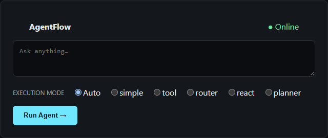

<a id="top"></a>

# AgentFlow

### Multi-Architecture AI Agent Orchestration Platform

> **The right agent architecture for every task.**


AgentFlow is an AI orchestration platform that selects and executes the appropriate agent architecture for each query.

Instead of forcing every task through the same agent pattern, AgentFlow supports five execution strategies — Simple, Tool-Using, Router, ReAct, and Planning — behind a unified FastAPI API and React console. The core problem it solves is choosing the right control strategy for the task, not simply adding another agent.

**[Quick Start](#quick-start) · [Architecture Docs](docs/ARCHITECTURE.md) · [GitHub](https://github.com/emkays-codelabs/ai-engineering-portfolio/tree/main/03_AgentFlow)**

---

## Overview

Building an AI agent means choosing an execution strategy — answer directly, call tools, classify-and-route, reason iteratively, or plan ahead — and that choice has real trade-offs in latency, cost, and reliability. Most implementations pick one strategy and stop there, leaving those trade-offs invisible.

AgentFlow implements five of them side by side behind a single interface, lets an LLM classifier pick the right one automatically (`mode="auto"`), and shows exactly how it got the answer: which architecture ran, which tools it called, and how long it took. Manual mode selection remains available for direct architecture-to-architecture comparison.

[Back to top](#top)

## Architecture

<svg viewBox="0 0 880 430" xmlns="http://www.w3.org/2000/svg" role="img" aria-labelledby="af-diagram-title">
  <title id="af-diagram-title">AgentFlow architecture: a query is classified and dispatched to one of five agents, which use the tool registry and the EURI LLM</title>
  <style>
    .af-box { fill: #ffffff; stroke: #1f2a44; stroke-width: 1.6; }
    .af-box--accent { fill: #fff4ea; stroke: #c8641c; }
    .af-text { fill: #1f2a44; font-family: -apple-system, "Segoe UI", Helvetica, Arial, sans-serif; }
    .af-text--sub { fill: #5b6472; font-family: -apple-system, "Segoe UI", Helvetica, Arial, sans-serif; }
    .af-edge { stroke: #8a93a3; stroke-width: 1.6; fill: none; marker-end: url(#af-arrow); }
    @media (prefers-color-scheme: dark) {
      .af-box { fill: #161b22; stroke: #7d8798; }
      .af-box--accent { fill: #2a1d12; stroke: #e08a3c; }
      .af-text { fill: #e6e8eb; }
      .af-text--sub { fill: #9aa4b2; }
      .af-edge { stroke: #6b7280; }
    }
  </style>
  <defs>
    <marker id="af-arrow" viewBox="0 0 10 10" refX="8" refY="5" markerWidth="7" markerHeight="7" orient="auto-start-reverse">
      <path d="M0,0 L10,5 L0,10 z" class="af-text--sub" />
    </marker>
  </defs>

  <rect x="350" y="6" width="180" height="38" rx="6" class="af-box" />
  <text x="440" y="30" text-anchor="middle" class="af-text" font-size="14" font-weight="600">USER QUERY</text>

  <path d="M440,44 L440,66" class="af-edge" />

  <rect x="330" y="68" width="220" height="46" rx="6" class="af-box--accent" />
  <text x="440" y="88" text-anchor="middle" class="af-text" font-size="14" font-weight="700">ORCHESTRATOR</text>
  <text x="440" y="104" text-anchor="middle" class="af-text--sub" font-size="11">classify (mode=auto) or dispatch directly</text>

  <path d="M440,114 L440,128 L80,128 L80,150" class="af-edge" />
  <path d="M440,114 L440,128 L260,128 L260,150" class="af-edge" />
  <path d="M440,114 L440,150" class="af-edge" />
  <path d="M440,114 L440,128 L620,128 L620,150" class="af-edge" />
  <path d="M440,114 L440,128 L800,128 L800,150" class="af-edge" />

  <g font-size="13" font-weight="600">
    <rect x="20" y="152" width="120" height="40" rx="6" class="af-box" />
    <text x="80" y="177" text-anchor="middle" class="af-text">Simple</text>

    <rect x="200" y="152" width="120" height="40" rx="6" class="af-box" />
    <text x="260" y="177" text-anchor="middle" class="af-text">Tool</text>

    <rect x="380" y="152" width="120" height="40" rx="6" class="af-box" />
    <text x="440" y="177" text-anchor="middle" class="af-text">Router</text>

    <rect x="560" y="152" width="120" height="40" rx="6" class="af-box" />
    <text x="620" y="177" text-anchor="middle" class="af-text">ReAct</text>

    <rect x="740" y="152" width="120" height="40" rx="6" class="af-box" />
    <text x="800" y="177" text-anchor="middle" class="af-text">Planner</text>
  </g>

  <path d="M80,192 L80,210 L440,210 L440,222" class="af-edge" />
  <path d="M260,192 L260,210 L440,210" class="af-edge" />
  <path d="M440,192 L440,222" class="af-edge" />
  <path d="M620,192 L620,210 L440,210" class="af-edge" />
  <path d="M800,192 L800,210 L440,210" class="af-edge" />

  <path d="M440,222 L440,236 L280,236 L280,250" class="af-edge" />
  <path d="M440,236 L600,236 L600,250" class="af-edge" />

  <rect x="190" y="252" width="180" height="42" rx="6" class="af-box--accent" />
  <text x="280" y="278" text-anchor="middle" class="af-text" font-size="14" font-weight="700">EURI LLM</text>

  <rect x="510" y="252" width="180" height="42" rx="6" class="af-box" />
  <text x="600" y="272" text-anchor="middle" class="af-text" font-size="13" font-weight="600">Tool Registry</text>
  <text x="600" y="287" text-anchor="middle" class="af-text--sub" font-size="10">calculator + search</text>

  <path d="M600,294 L600,308 L520,308 L520,322" class="af-edge" />
  <path d="M600,308 L680,308 L680,322" class="af-edge" />

  <rect x="440" y="324" width="160" height="38" rx="6" class="af-box" />
  <text x="520" y="348" text-anchor="middle" class="af-text" font-size="12" font-weight="600">Calculator</text>

  <rect x="600" y="324" width="160" height="38" rx="6" class="af-box" />
  <text x="680" y="348" text-anchor="middle" class="af-text" font-size="12" font-weight="600">Tavily Search</text>

  <text x="440" y="410" text-anchor="middle" class="af-text--sub" font-size="11">Agents call the LLM directly, and the tool registry when their strategy needs it — the registry never calls the LLM.</text>
</svg>

An orchestrator sits in front of all five architectures: given `mode="auto"`, it classifies the query and dispatches to the architecture it judges best; given an explicit mode, it dispatches directly — useful for demoing or comparing architectures side by side. See [docs/HLD.md](docs/HLD.md) for the full component breakdown and [docs/LLD.md](docs/LLD.md) for module-level detail.

[Back to top](#top)

## Five Agent Architectures

1. **Simple** — one direct LLM call.
2. **Tool-Using** — the model can select and call tools (calculator, web search).
3. **Router** — a classifier routes the query to Math, Coding, Research, or General, each with a specialized prompt.
4. **ReAct** — explicitly demonstrates Reason → Action → Observation → Answer.
5. **Planner** — creates a multi-step plan, executes it, and synthesizes the result.

The point isn't to crown one architecture "best." It's to make the trade-offs between them observable, and to say plainly when each pattern earns its complexity — see [Architecture Comparison](#architecture-comparison).

All five agents share the same EURI LLM backend and the same two tools — a safe local **Calculator** (AST-whitelist arithmetic, never executes arbitrary input) and live web **Search** through Tavily.

[Back to top](#top)

## Key Capabilities

| Capability | Implementation |
|---|---|
| 🧠 Architecture Selection | LLM classifier (`temperature=0`, JSON-only) picks Simple / Tool / Router / ReAct / Planner |
| 🤖 Agent Strategies | Five architectures behind one uniform `AgentResult` contract |
| 🔧 Tool Integration | AST-whitelist calculator + Tavily web search |
| 🔄 Orchestration | Central dispatcher (`orchestrator.run`) with `mode="auto"` or manual override |
| 🔍 Execution Tracing | Every response includes a step-by-step `steps` trace (Thought/Action/Observation for ReAct, plan steps for Planner) |
| 📊 Evaluation | Real latency, LLM-call, and tool-call counts + estimated cost; accuracy explicitly "Not yet measured" |
| 🧪 Testing | 41 automated backend tests, fully mocked, no live network calls |
| 🌐 API | FastAPI (`/api/run`, `/api/benchmark`, `/api/health`) |
| 🖥️ Console | React + Vite — query box, architecture selector, execution trace, evaluation dashboard |
| 🐳 Deployment | Docker Compose (backend + frontend containers), verified working end-to-end |

[Back to top](#top)

## Technology Stack

**Backend:** Python 3.10+ · FastAPI · Pydantic · uv
**AI:** EURI API (OpenAI-compatible) · Tavily Search
**Tools:** AST-based calculator · Tavily web search
**Frontend:** React 19 · Vite · React Router
**Testing:** pytest (41 tests, mocked)
**Deployment:** Docker · Docker Compose · nginx (frontend static serving)

[Back to top](#top)

## Quick Start

| Goal | Command |
|---|---|
| Run one architecture from a terminal | `uv run cli/simple_agent.py "What is 25 * 48?"` |
| Run the full HTTP API | `uv run uvicorn backend.app.main:app --reload --port 8000` |
| Use the interactive web console | `cd frontend && npm install && npm run dev` |
| Run backend + frontend as containers | `docker compose up --build` |

All four call into the same `backend/app/agents/*.run(question)` functions underneath — no logic is duplicated between the CLI, the API, and the frontend.

### Prerequisites & Environment

This project uses [uv](https://docs.astral.sh/uv/) for Python dependency management and `npm` for the frontend. No API keys are committed to this repository.

```bash
uv sync   # creates .venv, installs exact versions from uv.lock
```

Copy `.env.example` to `.env` and set:

```env
EURI_API_KEY=your_real_euri_key
EURI_MODEL=gpt-4.1-nano
EURI_BASE_URL=https://api.euron.one/api/v1/euri
TAVILY_API_KEY=your_real_tavily_key
```

### Backend

```bash
uv run uvicorn backend.app.main:app --reload --port 8000
```

| Endpoint | Method | Description |
|---|---|---|
| `/api/health` | GET | Reports whether `EURI_API_KEY`/`TAVILY_API_KEY` are configured (booleans only). |
| `/api/run` | POST | `{"query": "...", "mode": "auto\|simple\|tool\|router\|react\|planner"}` → an `AgentResult` plus `estimated_cost_usd`. |
| `/api/benchmark` | POST | Runs the 12 fixed test prompts across all five architectures and returns per-architecture metrics. |

### Frontend

```bash
cd frontend
npm install
cp .env.example .env   # sets VITE_API_URL, defaults to http://localhost:8000
npm run dev
```

Visit `http://localhost:5173` for the landing page, or `http://localhost:5173/console` for the interactive console.

> **Windows note:** if your project path contains an `&`, `npm run <script>` may fail with `'...' is not recognized as an internal or external command` — a `cmd.exe` quirk with `&` in paths, not a project bug. Work around it with `node node_modules/vite/bin/vite.js <dev|build>` instead of `npm run dev` / `npm run build`, or move the project to a path without `&`.

### CLI

```bash
uv run cli/simple_agent.py "What is 25 * 48?"
uv run cli/tool_agent.py "Calculate 1250 / 25 + 17."
uv run cli/router_agent.py "Write Python code for factorial using recursion."
uv run cli/react_agent.py "What is 25 * 48?"
uv run cli/planning_agent.py "Research the latest Python release and summarize three notable changes."
```

### Docker

Both services also run as containers — the frontend build is multi-stage (Node → static bundle served by nginx, never the Vite dev server), and no API key ever reaches either image; they're injected at container runtime.

```bash
cp .env.example .env   # fill in your real EURI_API_KEY / TAVILY_API_KEY
docker compose up --build
```

Frontend: `http://localhost:8080` · Backend: `http://localhost:8000`. This is an alternative to the `uv run` / `npm run dev` flow above, not a replacement for it — local development doesn't require Docker.

[Back to top](#top)

## Console

AgentFlow provides an interactive React console for running queries, selecting architectures, inspecting execution traces, and comparing evaluation metrics.

<p align="center">
  
</p>

[Back to top](#top)

## Architecture Comparison

There is no universally best agent — choose the simplest architecture that reliably solves the task.

```text
                       CONTROL / COMPLEXITY

Simple ───── Tool ───── Router ───── ReAct ───── Planner
  │           │           │            │            │
 Low        tool        routing    iterative    planning &
complexity  calls                  reasoning    synthesis
```

More sophistication doesn't automatically mean a better result — the objective isn't to crown one architecture, it's to expose the trade-offs.

| Agent Type | Best Use Case | Advantage | Limitation |
|---|---|---|---|
| **Simple** | Stable, straightforward questions | Lowest architectural complexity; fast and easy to maintain | No deterministic tools, routing, or explicit multi-step control |
| **Tool Agent** | Questions requiring calculations or external data | Model can dynamically select among multiple tools | Tool choice depends on model behavior; less explicit control than a router |
| **Router** | Systems with clearly separable domains | Predictable dispatch into specialized workflows | Classification can be wrong; rigid routes can struggle with mixed queries |
| **ReAct** | Tasks where intermediate observations change the next action | Makes iterative tool use explicit and traceable | More LLM turns increase latency, cost, and failure surface |
| **Planner** | Multi-step research, analysis, and workflows | Separates planning from execution and final synthesis | Plans can be unnecessary for simple queries and can introduce planning errors |

- *Explain RAG* → Simple
- *Calculate revenue* → Tool
- *Customer-support assistant* → Router
- *Research with iterative searches* → ReAct
- *Complex multi-step analysis* → Planner

### Simple Agent

Use when the query is self-contained and does not need external data or deterministic computation. **Trade-off:** excellent simplicity, but it cannot reliably delegate arithmetic or live research to tools.

### Tool-Using Agent

Use when the assistant needs access to capabilities such as calculators, search, databases, or internal business systems; the model decides which tool to invoke. **Trade-off:** flexible tool selection, but the model remains responsible for choosing the correct tool.

### Router Agent

Use when requests fall into known categories, each with a specialized workflow — this project uses four routes: **Math, Coding, Research, General**. **Trade-off:** easy to reason about operationally, but a bad classification can send a request down the wrong path.

### ReAct Agent

Use when the task requires iterative interaction with tools: `Reason → Action → Observation → Reason → ... → Answer`. **Trade-off:** powerful for interactive tasks, but repeated LLM calls can increase latency and cost.

### Planning Agent

Use when the task has several dependent steps — the agent produces a plan, executes each step, then synthesizes a final answer. **Trade-off:** stronger workflow structure, but planning adds overhead and the plan itself can be incorrect or unnecessarily complex.

[Back to top](#top)

## Execution Traces

### ReAct

A successful ReAct run should visibly resemble:

```text
Thought: I need an exact calculation.
Action: calculator[25 * 48]
Observation: 1200
Thought: The calculation is complete.
Final Answer: 25 * 48 = 1200.
```

The actual trace is generated by the model at runtime; the example above illustrates the required architecture, not a hard-coded answer.

### Planning

A successful planning run should show:

```text
Generated plan with 3 steps
Step 1 [search]: Find current information relevant to the question. -> ...
Step 2 [llm]: Analyze the collected evidence. -> ...
Step 3 [llm]: Synthesize the final answer. -> ...
Synthesized final answer
```

The plan is generated as JSON and executed by the harness.

[Back to top](#top)

## Evaluation

`POST /api/benchmark` (and `uv run run_all.py`) run the 12 test prompts and report **real, measured** metrics per architecture: average latency, LLM call count, tool call count, and an estimated cost (derived from a rough tokens-per-call constant, clearly not billed cost — EURI's API doesn't expose real billing).

> **Evaluation principle**
>
> AgentFlow reports measured system metrics only. Accuracy is currently marked **Not yet measured** because no labeled evaluation dataset exists yet. No fabricated benchmark numbers.

[Back to top](#top)

## Benchmark Suite

A fixed 12-prompt suite exercises different task types across all five architectures. Each entry records the agent selected, the tool used, the final output, and why that agent was suitable.

| # | Prompt | Agent selected | Expected tool | Why suitable |
|---:|---|---|---|---|
| 1 | What is 25 * 48? | Simple | None | Baseline direct answer |
| 2 | Explain machine learning in simple terms. | Simple | None | Stable conceptual explanation |
| 3 | Calculate 1250 / 25 + 17. | Tool Agent | Calculator | Demonstrates dynamic tool selection |
| 4 | Find the latest information about AI agents. | Tool Agent | Search | Requires current external information |
| 5 | What is 19 * 37 - 12? | Router | Calculator | Clear Math route |
| 6 | Write Python code for factorial using recursion. | Router | None | Clear Coding route |
| 7 | What are the latest major developments in generative AI this week? | ReAct | Search | Shows iterative action/observation |
| 8 | Calculate 48 * 25 and explain the result. | ReAct | Calculator | Clear ReAct demonstration |
| 9 | Compare the current roles of an AI architect and an AI generalist. | Planner | Search | Multi-step comparison and synthesis |
| 10 | Research the latest Python release and summarize three notable changes. | Planner | Search | Research naturally decomposes into steps |
| 11 | Explain why tool use can improve reliability for arithmetic questions. | Planner | LLM | Multi-step explanation and synthesis |
| 12 | Find current information about the EURI API and summarize what it is used for. | Tool Agent | Search | Current external information |

Run it yourself:

```bash
uv run run_all.py
```

Results are saved to `test_results.json` (gitignored). Paste the generated values into a copy of the table above for a fully reproducible record of observed output.

[Back to top](#top)

## Reliability & Safety

- Missing `EURI_API_KEY` raises a `ConfigurationError` (503 over the API), producing a clear message rather than a raw SDK stack trace.
- Missing `TAVILY_API_KEY` raises the same `ConfigurationError` for search.
- The calculator uses an AST whitelist instead of executing arbitrary Python with raw `eval()`.
- ReAct and Tool Agent have bounded iteration counts to prevent unbounded loops.
- A failing prompt in the benchmark is recorded as an error and does not abort the other 11.
- Secrets are excluded through `.gitignore` (`.env`, `frontend/.env`).

[Back to top](#top)

## Testing

```bash
uv run pytest -v
```

41 tests, all mocked against the LLM/tool layer — no live network calls in CI.

[Back to top](#top)

## Project Structure

```text
agentflow/
├── backend/
│   ├── app/
│   │   ├── main.py                 # FastAPI app: /api/run, /api/benchmark, /api/health
│   │   ├── config.py                # centralized environment configuration
│   │   ├── agents/                  # the five architectures (base.py + one file each)
│   │   ├── orchestration/           # classifier, orchestrator, execution seam
│   │   ├── tools/                   # calculator, search, tool registry
│   │   ├── llm/                     # EURI (OpenAI-compatible) client wrapper
│   │   ├── evaluation/              # benchmark harness + real latency/cost metrics
│   │   └── schemas/                 # Pydantic request/response models
│   ├── tests/                        # 41 tests, no live network calls
│   └── Dockerfile                    # backend container (uv + Uvicorn)
├── cli/                              # thin standalone wrappers over backend.app.agents
├── frontend/                          # React + Vite landing page and console UI
│   ├── src/{components,pages,services,hooks,data}/
│   ├── Dockerfile                    # multi-stage: Node build -> nginx serve
│   └── nginx.conf                    # SPA fallback so client-side routes survive a refresh
├── screenshots/                       # console.png etc.
├── docs/{PRD,HLD,LLD,ARCHITECTURE}.md, docs/superpowers/{specs,plans}/
├── run_all.py                         # runs the 12-prompt benchmark, writes test_results.json
├── docker-compose.yml                 # wires backend (:8000) + frontend (:8080) together
├── pyproject.toml, uv.lock            # Python deps, managed with uv
├── .env.example
├── .gitignore, .dockerignore
└── README.md
```

`backend/app/agents/` holds the five agent implementations as plain functions (`run(question) -> AgentResult`). `backend/app/llm/` holds the shared EURI client wrapper, and `backend/app/tools/` holds the calculator/search tools and the tool-call registry they use. `backend/app/orchestration/` classifies and dispatches a question to the right agent, `backend/app/evaluation/` runs the benchmark suite, and `backend/app/main.py` exposes it all over HTTP through FastAPI. `cli/` holds thin command-line wrappers so each agent can still be run standalone from a terminal. `frontend/` is the React landing page and console UI that talks to the API.

[Back to top](#top)

## Documentation

- [PRD](docs/PRD.md) — problem, product scope, requirements, acceptance criteria
- [High-Level Design](docs/HLD.md) — components, data flow, dependency boundaries
- [Low-Level Design](docs/LLD.md) — module contracts, error ownership, API examples
- [Architecture](docs/ARCHITECTURE.md) — one-page summary
- [Frontend README](frontend/README.md)

[Back to top](#top)

## Engineering Decisions

**Why five architectures?** To make control-strategy trade-offs observable rather than assuming one agent pattern fits every task.

**Why a common `AgentResult` contract?** So every architecture can be benchmarked, compared, and rendered by the frontend through the same shape — see `make_result()` in `backend/app/agents/base.py`, which every agent uses instead of a bare dict.

**Why isolate EURI behind a client wrapper?** To prevent provider-specific SDK concerns from leaking into agent logic — every module calls the LLM only through `backend/app/llm/euri_client.py`'s `chat()`.

**Why AST instead of `eval()`?** To provide arithmetic evaluation without executing arbitrary Python — `calculator.py` walks a closed whitelist of AST node types instead.

**Why does the orchestrator build its agent lookup inside `run()`, not at module scope?** So `@patch("...orchestrator.simple")`-style test mocks are actually observed by dispatch, instead of being shadowed by a dict captured at import time.

**Why does `execution.py` exist as a thin passthrough?** It's a seam reserved for retry/timeout/logging concerns that aren't needed yet — adding it now, before there's a real need, would be speculative complexity the codebase doesn't carry elsewhere.

[Back to top](#top)

## Copyright & Ownership

© 2026 SaffronyxAI.in. All Rights Reserved.

Original work by **Mahesh Kumar, Founder & CEO of SaffronyxAI.in**. Unauthorized copying, reproduction, modification, redistribution, or commercial use is prohibited without prior written permission.

[Back to top](#top)
