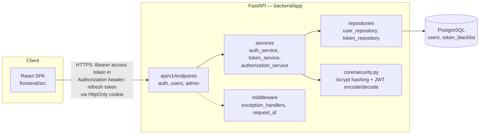
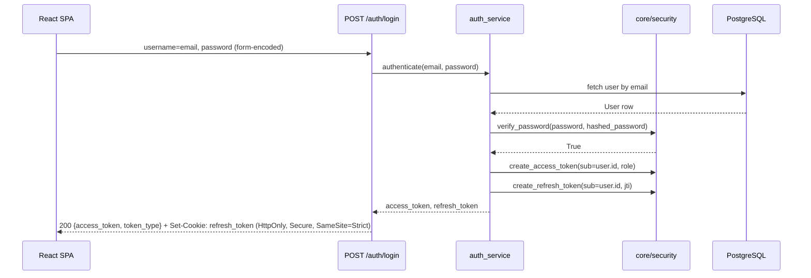
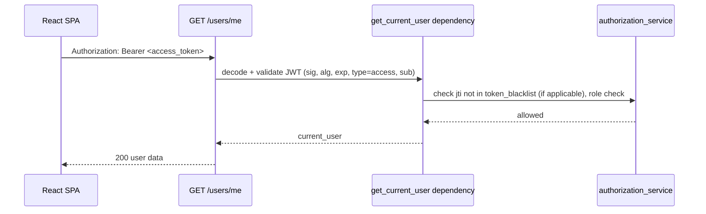

# High-Level Design — Secure Authentication API

**Version**: 1.0 | **Date**: 2026-09-20 | **Author**: Mahesh Kumar

---

## 1. Architecture Overview

One-directional dependency flow: `api/` → `services/` → `repositories/` → `PostgreSQL`, per
`rules/15-backend-structure.md`. `services/` also calls `core/security.py` directly for
hashing/JWT operations (a shared utility, not a layer to route through `repositories/`).

## 2. Components

| Component | Responsibility | Technology |
|---|---|---|
| `api/v1/endpoints/` | Parse HTTP requests, call one service method, return response. No business logic. | FastAPI routers |
| `services/auth_service.py` | Registration, credential verification, login orchestration | Python |
| `services/token_service.py` | JWT issuance, refresh rotation, blacklist checks | PyJWT |
| `services/authorization_service.py` | Role/permission checks used by route dependencies | Python |
| `repositories/user_repository.py` | All `users` table queries | SQLAlchemy |
| `repositories/token_repository.py` | All `token_blacklist` table queries | SQLAlchemy |
| `core/security.py` | Password hashing (bcrypt via passlib), JWT encode/decode | passlib, PyJWT |
| `core/database.py` | Engine, session factory, declarative `Base` | SQLAlchemy |
| `middleware/exception_handlers.py` | Converts domain exceptions to the project's error envelope | FastAPI |
| `frontend/src/features/auth/` | Login/register forms, auth state | React, TypeScript |
| `frontend/src/services/api-client.ts` | Centralized HTTP client — only layer calling the backend | Axios/fetch |

## 3. Data Flow

**Login (OAuth2 Password Flow):**

**Protected route access:**

## 4. External Dependencies

| Dependency | Purpose | If unavailable |
|---|---|---|
| PostgreSQL | Primary datastore (users, token_blacklist) | Readiness check fails (`/health`), API returns 503 rather than a misleading 200 — no in-process fallback store |

No third-party auth providers, payment gateways, or external APIs — consistent with the
non-goals in `CLAUDE.md` Project Identity (no social login, no billing).

## 5. Technology Stack

| Layer | Technology | Rationale |
|---|---|---|
| API framework | FastAPI | Async-native, Pydantic-validated request/response contracts, built-in OpenAPI/Swagger UI (needed for the YouTube demo's "Protected API" walkthrough) |
| ORM / migrations | SQLAlchemy 2.0 + Alembic | Typed declarative models, explicit upgrade/downgrade migrations (`rules/02-architecture.md` Rule 4) |
| Password hashing | passlib + bcrypt | Explicit requirement (`task.md`) — see [ADR-0001](../adr/0001-jwt-library-choice.md) sibling decision for the paired JWT choice |
| JWT | PyJWT | See [ADR-0001](../adr/0001-jwt-library-choice.md) |
| Token transport | Bearer access token (body) + HttpOnly refresh cookie | See [ADR-0002](../adr/0002-token-transport-and-refresh-rotation.md) |
| Frontend | React + TypeScript + Vite + React Router | Confirmed stack; matches `frontend/src/routes/` scaffold |
| Database | PostgreSQL (deploy), SQLite (test) | `rules/04-testing-quality.md` Rule 4 — self-contained, deterministic tests without a live Postgres dependency |

## 6. Cross-Cutting Concerns

- **Auth**: enforced exclusively via the `get_current_user` FastAPI dependency (`core/dependencies.py`) — never re-implemented per-route. Role checks live in `authorization_service.py`, never inferred from client-supplied data.
- **Error handling**: domain exceptions (`app/exceptions/auth_exceptions.py`) are raised by services; `middleware/exception_handlers.py` is the single place that maps them to the project's error envelope (`error`, `code`, `message`, `details`) per `rules/02-architecture.md` Rule 9. Routes never construct raw `HTTPException` bodies ad hoc for domain errors.
- **Observability**: structured (JSON) logs with a request ID injected by `middleware/request_id.py`; deferred implementation to the Observability/Deployment phase (`F1`/`F2` on the task board).

## 7. Security & Trust Boundaries

- **Client (untrusted) ↔ API (trust boundary)**: every protected route validates the JWT's signature, algorithm, expiry, `sub`, and token `type` (rejecting a refresh token presented as an access token) before trusting any claim in it — see ADR-0002.
- **Role claims**: the JWT carries the user's role at issuance time; role/permission checks always re-verify against the current DB row in `authorization_service.py`, not just the token claim, so a role change or deactivation takes effect without waiting for token expiry on privilege checks that matter (e.g. admin routes).
- **Refresh token**: never exposed to frontend JavaScript (HttpOnly cookie) — eliminates XSS exfiltration of the long-lived credential. Access token lives only in React state (memory), never `localStorage`.
- **API ↔ DB**: internal only, not exposed publicly; credentials via env var (`DATABASE_URL`), never hardcoded (`rules/02-architecture.md` Rule 7).

## 8. Key Trade-offs

- **Bearer body + cookie split (not both in body, not both in cookies)**: chosen so the access token stays easily testable via Swagger UI / curl / Postman (required for the YouTube demo) while the higher-value, longer-lived refresh token gets the stronger XSS protection a cookie provides. Full rationale in ADR-0002.
- **Stateless JWT with a blacklist, not a full server-side session table**: keeps access-token validation fast (no DB hit per request) while still allowing revocation (logout, refresh-reuse detection) via a small insert-only table — a deliberate middle ground between pure stateless JWT (no revocation) and full server-side sessions (a DB hit on every request).

---

## Copyright & Ownership

© 2026 SaffronyxAI.in. All Rights Reserved.

Created and maintained by **Mahesh Kumar**, Founder & CEO of SaffronyxAI.in.

Third-party libraries, frameworks, assets, generated materials, client contributions, and
other external materials remain subject to their respective licenses and ownership terms.
