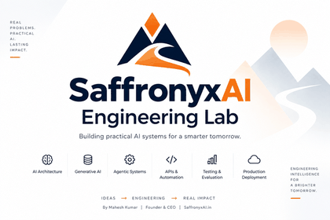

  

An engineering portfolio of end-to-end AI systems built by **Mahesh Kumar**,
Founder & CEO of **SaffronyxAI.in** — spanning AI architecture, Generative
AI, agentic systems, APIs, automation, evaluation, testing, and
production-oriented deployment.

---

## About SaffronyxAI.in

SaffronyxAI.in engineers practical, production-oriented AI systems that
turn real business problems into deployable intelligent products.

The work spans the full engineering lifecycle — from requirements and
problem definition through architecture, implementation, testing,
evaluation, deployment, and operational reliability.

Core areas include:

- AI & GenAI architecture
- Agentic AI systems
- RAG and AI copilots
- Backend and API engineering
- AI automation
- Evaluation and testing
- Production-oriented deployment
- Forward Deployment Engineering

---

## 📂 Projects

| # | Project | Description |
|---|---|---|
| 01 | **[AI Customer Support Resolution Platform](01_ai-support-fde-case-study)** | A Forward Deployment Engineering case study covering client discovery, problem definition, solution architecture, a rule-based intent-classification MVP, automated testing, and a phased deployment strategy. |
| 02 | **[NEXORA AI Support Copilot](02_NEXORA-AI-Customer-Support-Automation-Platform)** | An end-to-end AI customer-support automation platform combining RAG, an agent copilot, intelligent ticketing with automated assignment, and an administrative console — built with FastAPI and Next.js, backed by Supabase/pgvector, with comprehensive automated testing. |
| 03 | **[AgentFlow](03_AgentFlow)** | A multi-architecture AI agent orchestration platform implementing Simple, Tool-Using, Router, ReAct, and Planning agents. An LLM-based classifier automatically selects the appropriate architecture for each query. Built with FastAPI and React, with extensible tool integration, execution tracing, automated benchmarking, and measured latency, cost, and tool-call metrics. |

More projects will be added as they are completed.

---

## Engineering Philosophy

The objective is not simply to demonstrate AI capabilities.

Each project is designed to demonstrate the engineering discipline
required to move an AI system from problem definition → architecture →
working MVP → evaluation → testing → deployment.

Where performance metrics are presented, they are based on measured
system behavior rather than fabricated benchmarks or claims.

---

## Copyright & Ownership

© 2026 SaffronyxAI.in. All Rights Reserved.

All projects in this repository are original work created by
**Mahesh Kumar, Founder & CEO of SaffronyxAI.in**.

Unauthorized copying, reproduction, modification, redistribution, or
commercial use of this material, in whole or in part, is prohibited without
prior written permission from SaffronyxAI.in.

**Author:** Mahesh Kumar
**Role:** Founder & CEO
**Company:** SaffronyxAI.in
